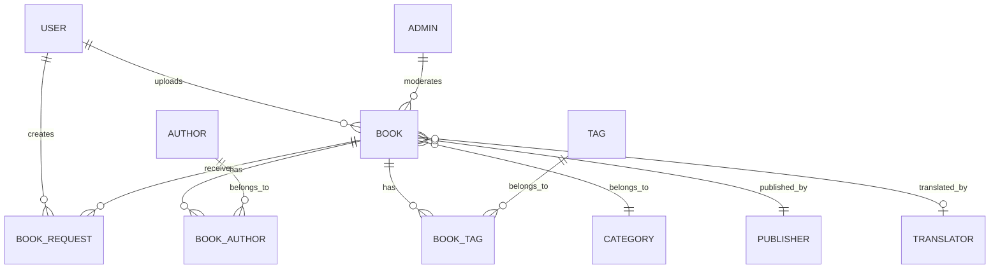

<p align="center">
  
  <h1 align="center">📚 BookLover</h1>
  <p align="center">
    <strong>A full-featured Library Management System built with Laravel 10</strong>
  </p>
  <p align="center">
    <a href="#features">Features</a> •
    <a href="#tech-stack">Tech Stack</a> •
    <a href="#installation">Installation</a> •
    <a href="#usage">Usage</a> •
    <a href="#architecture">Architecture</a> •
    <a href="#contributing">Contributing</a> •
    <a href="#license">License</a>
  </p>
  <p align="center">
    
    
    
    
    
  </p>
</p>

---

## 📖 About

**BookLover** is a comprehensive library management web application that enables users to browse, search, request, borrow, and return books — all through an intuitive web interface. It features a complete admin panel, dual payment gateway integration (bKash & SSLCommerz), a user dashboard with book request/approval workflows, and much more.

Whether you're managing a personal book collection, a community library, or a small institutional library, BookLover provides all the tools you need.

---

## ✨ Features

### 📚 Book Management
- **Browse & Discover** — View all available books with cover images, authors, categories, and publishers
- **Search & Advanced Search** — Find books quickly by title, author, category, tags, or publisher
- **Top Borrowed Books** — Discover the most popular borrowed books
- **Top Searched Books** — See trending searches across the platform
- **Book Upload** — Users can upload and share their own books

### 👤 User System
- **Authentication** — Full registration, login, and email verification via Laravel Auth
- **User Profiles** — Public profile pages showcasing user activity and uploaded books
- **User Dashboard** — Personal dashboard for managing books, requests, and orders

### 📋 Request & Borrow Workflow
- **Book Requests** — Users can request to borrow any available book
- **Request Management** — View, update, and delete pending requests
- **Approval System** — Book owners can approve or reject borrow requests
- **Order Tracking** — Track all borrowing orders with statuses
- **Book Returns** — Streamlined return process with owner confirmation

### 🔐 Admin Panel
- **Separate Admin Authentication** — Dedicated admin login with password reset support
- **Book Administration** — Full CRUD operations with approval/unapproval workflow
- **Author Management** — Create, view, update, and delete author records
- **Category Management** — Organize books into categories with CRUD operations
- **Publisher Management** — Manage publisher records with full CRUD
- **Content Moderation** — Review and approve/unapprove user-submitted books

### 💳 Payment Integration
- **bKash Tokenized Payment** — Bangladesh's leading mobile payment gateway
  - Create payments, search transactions, process refunds
- **SSLCommerz** — Full-featured payment gateway with:
  - Easy checkout & hosted checkout options
  - AJAX-based payments
  - IPN (Instant Payment Notification) support
  - Success, fail, and cancel handlers

### 🧩 Additional Features
- **Category Filtering** — Browse books by specific categories
- **Tags System** — Flexible book tagging for better discoverability
- **Translators Support** — Track translators for translated works
- **Image Slider** — Dynamic homepage slider for featured content
- **Rules Page** — Display library rules and guidelines
- **Geolocation** — Position/coordinates tracking support

---

## Screenshots:


---

## 🛠️ Tech Stack

| Layer | Technology |
|:------|:-----------|
| **Framework** | Laravel 10.0 |
| **Language** | PHP 8.2+ |
| **Frontend** | Blade Templates (49.3%), Vue.js (0.1%) |
| **Database** | MySQL |
| **Authentication** | Laravel UI with Email Verification |
| **Payments** | bKash Tokenized API, SSLCommerz |
| **HTTP Client** | Guzzle 7.x |
| **Build Tool** | Laravel Mix (Webpack) |
| **Testing** | PHPUnit 10 |

---

## 🏗️ Architecture

### Directory Structure

```
BookLover/
├── app/
│   ├── Http/
│   │   └── Controllers/
│   │       ├── Auth/                    # User & Admin authentication
│   │       ├── Backend/                 # Admin panel controllers
│   │       │   ├── BooksController.php
│   │       │   ├── AuthorsController.php
│   │       │   ├── CategoriesController.php
│   │       │   └── PublishersController.php
│   │       ├── BooksController.php      # Public book operations
│   │       ├── CategoriesController.php # Category browsing
│   │       ├── DashboardsController.php # User dashboard
│   │       ├── UsersController.php      # User profiles
│   │       ├── BkashTokenizePaymentController.php
│   │       ├── SslCommerzPaymentController.php
│   │       ├── PagesController.php      # Static pages
│   │       ├── PositionController.php   # Geolocation
│   │       └── Rulecontroller.php       # Rules page
│   ├── Notifications/                   # Email & app notifications
│   ├── Library/                         # Custom library classes
│   ├── Providers/                       # Service providers
│   │
│   │── Admin.php          # Admin model
│   │── Author.php         # Author model
│   │── Book.php           # Book model
│   │── BookAuthor.php     # Book-Author pivot
│   │── BookRequest.php    # Borrow request model
│   │── BookTag.php        # Book-Tag pivot
│   │── Category.php       # Category model
│   │── Publisher.php       # Publisher model
│   │── Slider.php         # Homepage slider model
│   │── Tag.php            # Tag model
│   │── Translator.php     # Translator model
│   └── User.php           # User model
│
├── database/
│   ├── factories/         # Model factories
│   ├── migrations/        # Schema migrations
│   └── seeds/             # Database seeders
│
├── resources/             # Blade views & assets
├── routes/
│   └── web.php            # All application routes
├── public/                # Public assets
├── config/                # Configuration files
├── books.sql              # Sample database dump
├── Diagram.png            # System architecture diagram
├── composer.json          # PHP dependencies
└── package.json           # Node.js dependencies
```

### Entity Relationship



---

## 🚀 Installation

### Prerequisites

- **PHP** >= 8.2
- **Composer** >= 2.x
- **MySQL** >= 5.7
- **Node.js** >= 14.x & **npm**
- **XAMPP** / **Laravel Valet** / any local server environment

### Steps

**1. Clone the repository**

```bash
git clone https://github.com/MahirAzmain/BookLover.git
cd BookLover
```

**2. Install PHP dependencies**

```bash
composer install
```

**3. Install Node.js dependencies**

```bash
npm install
```

**4. Configure environment**

```bash
cp .env.example .env
php artisan key:generate
```

Edit `.env` with your database and payment gateway credentials:

```env
APP_NAME=BookLover
APP_URL=http://localhost:8000

DB_CONNECTION=mysql
DB_HOST=127.0.0.1
DB_PORT=3306
DB_DATABASE=booklover
DB_USERNAME=root
DB_PASSWORD=

# bKash Configuration
BKASH_TOKENIZE_SANDBOX=true
BKASH_TOKENIZE_APP_KEY=your_app_key
BKASH_TOKENIZE_APP_SECRET=your_app_secret
BKASH_TOKENIZE_USERNAME=your_username
BKASH_TOKENIZE_PASSWORD=your_password

# SSLCommerz Configuration
SSLCOMMERZ_STORE_ID=your_store_id
SSLCOMMERZ_STORE_PASSWORD=your_store_password
```

**5. Set up the database**

```bash
# Run migrations
php artisan migrate

# (Optional) Import sample data
mysql -u root -p booklover < books.sql

# (Optional) Seed the database
php artisan db:seed
```

**6. Compile frontend assets**

```bash
npm run dev
```

**7. Start the development server**

```bash
php artisan serve
```

Visit **[http://localhost:8000](http://localhost:8000)** in your browser. 🎉

---

## 📘 Usage

### User Roles

| Role | Access |
|:-----|:-------|
| **Guest** | Browse books, search, view categories |
| **Registered User** | All guest features + upload books, request borrows, manage dashboard, make payments |
| **Admin** | Full system management via `/admin` — manage books, authors, categories, publishers, approve/reject content |

### Key Routes

| Route | Description |
|:------|:------------|
| `/` | Homepage with featured slider |
| `/books` | Browse all books |
| `/books/search` | Search books |
| `/books/{slug}` | Book details page |
| `/books/upload/new` | Upload a new book |
| `/user/profile/{username}` | Public user profile |
| `/dashboard` | User dashboard |
| `/dashboard/books/request-list` | Manage borrow requests |
| `/dashboard/books/order-list` | View order history |
| `/admin` | Admin panel |
| `/bkash/payment` | bKash payment gateway |
| `/top-borrowed` | Most borrowed books |
| `/top-searchbooks` | Trending searches |
| `/rules` | Library rules & guidelines |

---

## 🧪 Testing

Run the test suite with PHPUnit:

```bash
php artisan test
# or
./vendor/bin/phpunit
```

---

## 🤝 Contributing

Contributions are welcome! Here's how you can help:

1. **Fork** the repository
2. **Create** a feature branch (`git checkout -b feature/amazing-feature`)
3. **Commit** your changes (`git commit -m 'Add amazing feature'`)
4. **Push** to the branch (`git push origin feature/amazing-feature`)
5. **Open** a Pull Request

Please ensure your code follows the existing code style and includes appropriate tests.

---

## 📄 License

This project is licensed under the **MIT License** — see the [LICENSE](LICENSE) file for details.

---

## 👤 Author

**Mahir Azmain Haque**

- GitHub: [@MahirAzmain](https://github.com/MahirAzmain)

---

<p align="center">
  Made with Laravel
</p>
